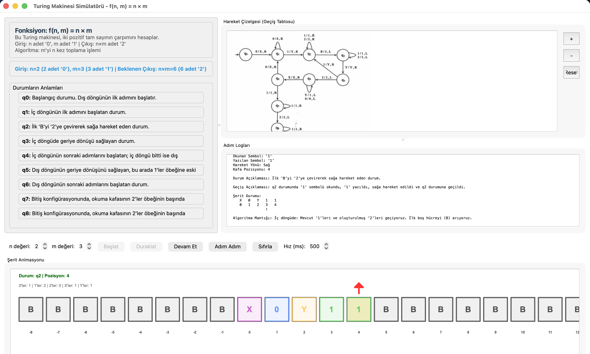
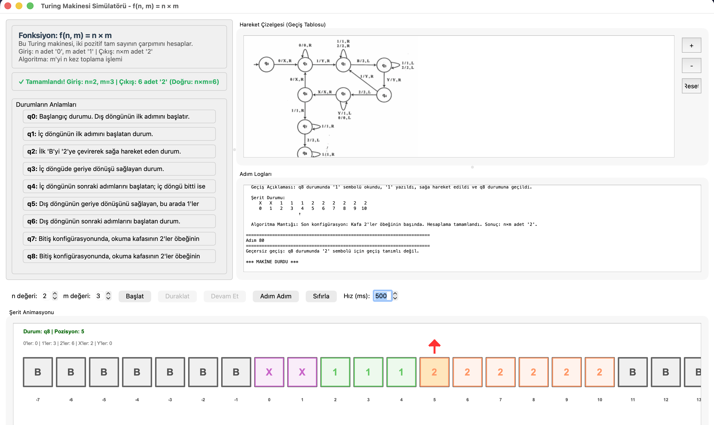
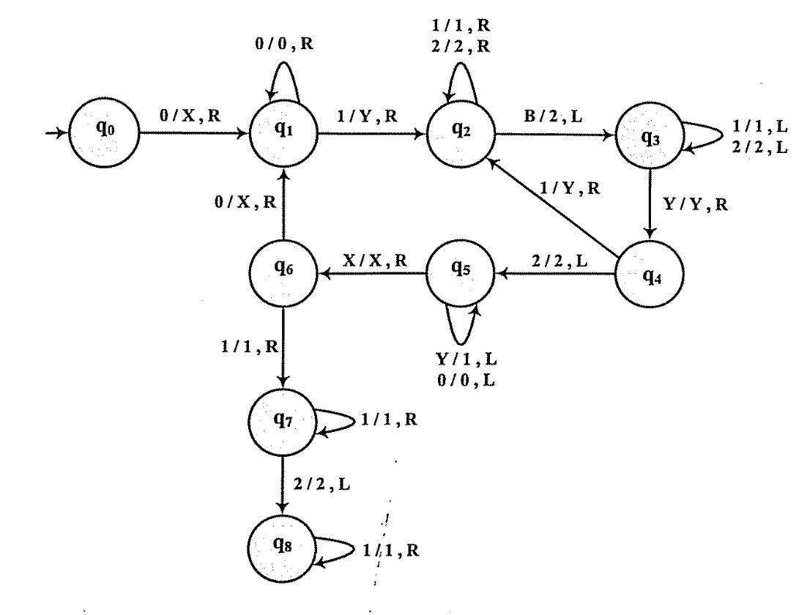

# Turing Makinesi Çarpma Simülatörü

Bu proje Prof. Dr. Ünal YARIMAĞAN'ın "Özdevinirler (Otomatlar) Kuramı ve Biçimsel Diller" kitabındaki örnek 6.3 deki çarpma turing makinesini uygular ve bunu animasyonla görselleştirir.

PyQt6 ile yazılmış bu uygulama, giriş şeridine yerleştirilen $0^n1^m$ biçimindeki diziyi adım adım işleyerek $n \times m$ sonucu kadar `2` üretir ve süreci görsel olarak izletir.

## Ekran Görüntüleri

Uygulamanın genel görünümü ve simülasyon aşamalarından örnekler:

<p align="center">
  
  
</p>

## Özellikler
- Giriş parametrelerini (n, m) arayüzden seçip tek tıkla çalıştırma
- Animasyonlu şerit görünümü, kafa konumu ve anlık durum takibi
- Başlat, duraklat, devam et, adım adım yürütme ve hız ayarı kontrolleri
- Her adım için log kaydı ve geçiş tablosu gösterimi

## Turing Makinesi Mantığı
Makinenin geçiş diyagramı ve tablosu aşağıdadır.

**Geçiş Tablosu:**


Özet akış:
- $q0$: İlk `0` işaretlenir (`X`) ve iç döngü başlatılır.
- $q1$: Kalan `0` blokları geçilir; ilk `1` bulununca `Y` ile işaretlenip $q2$'ye gidilir.
- $q2$: `1` ve `2` bloklarının sonuna kadar sağa gidilir; ilk `B` `2` yapılır ve sola dönülür ($q3$).
- $q3$: `Y` görülene kadar sola gidilir; `Y` sonrası iç döngü için $q2$ veya dış döngü için $q4$ devreye girer.
- $q4$: İç döngü devam edecekse yeni bir `Y` işaretleyip sağa gider; iç döngü bittiyse $q5$ ile dış döngü geri dönüşü başlatılır.
- $q5$: Sola giderken `Y` leri `1`e çevirir, `X` bulununca $q6$ ile bir sonraki `0` blokuna geçer.
- $q6$: Yeni `0` işaretlenir (`X`) ve süreç $q1$ ile yinelemeye hazırlanır; `1` biterse $q7$ ile son hizalama yapılır.
- $q7$–$q8$: Makinenin kafası `2` bloğunun başında duracak şekilde hizalanır ve duruma göre sonlandırılır.

Detaylı geçişler [turing_simulator/domain/machines/machine_multiply.py](turing_simulator/domain/machines/machine_multiply.py) dosyasında tanımlıdır; şerit ve durum güncellemeleri [turing_simulator/domain/entities/turing_machine.py](turing_simulator/domain/entities/turing_machine.py) tarafından yürütülür.

## Kurulum
1. (İsteğe bağlı) Sanal ortam oluşturun:
   ```bash
   python -m venv .venv
   source .venv/bin/activate  # Windows için: .venv\Scripts\activate
   ```
2. Bağımlılıkları yükleyin:
   ```bash
   pip install -r requirements.txt
   ```

## Çalıştırma
Proje kök dizinindeyken uygulamayı başlatın:
```bash
python turing_simulator/main.py
```
Arayüzde `n` ve `m` değerlerini seçip **Başlat** ile yürütmeyi başlatabilir, **Duraklat/Devam Et** ve **Adım Adım** ile süreci kontrol edebilirsiniz. Hız (ms) kutusu animasyon adım aralıklarını belirler, log paneli her geçişi ve yazılan sembolleri listeler.

## Proje Yapısı
- [turing_simulator/main.py](turing_simulator/main.py): Uygulama giriş noktası, makineyi oluşturur ve ana pencereyi başlatır.
- [turing_simulator/domain](turing_simulator/domain): Durum, geçiş, şerit ve Turing makinesi tanımları ile çarpma makinesinin geçiş tablosu.
- [turing_simulator/application](turing_simulator/application): Yürütme kontrolü ve adım açıklamalarını üreten servisler.
- [turing_simulator/presentation](turing_simulator/presentation): PyQt6 arayüzü, kontrol butonları, şerit animasyonu, geçiş tablosu ve log bileşenleri.

## Notlar
- Şerit boş sembolü `B` olarak kullanılır. Giriş biçimi $0^n1^m$ olmak üzere $n, m > 0$ için tanımlıdır.
- Makine maksimum 100000 adım içinde durmazsa sonsuz döngü uyarısı verir.

## Lisans
Bu proje **MIT License** altında lisanslanmıştır. 

Detaylı bilgi için [LICENSE](LICENSE) dosyasına bakınız.